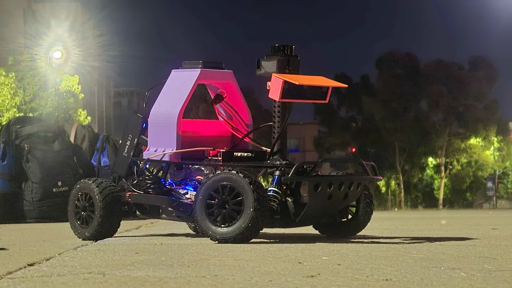
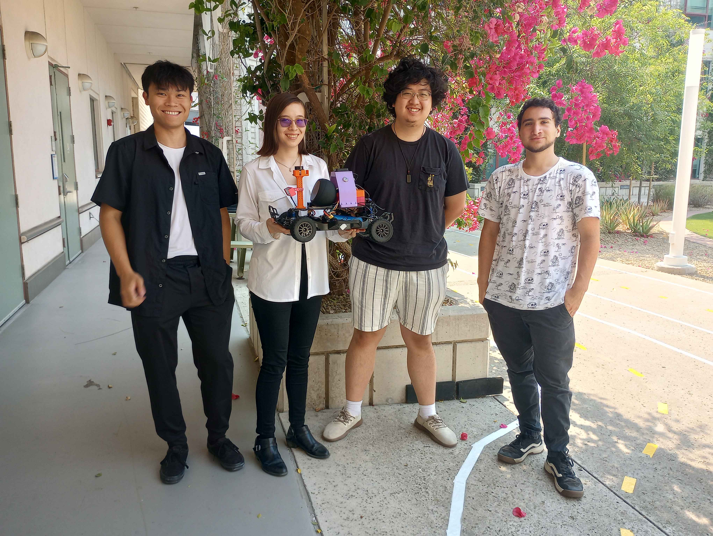

<h1 align="center">Music Production via Color Recognition </h1>
<!-- PROJECT LOGO -->
 

  
<h2>Team 6 - Odysseus </h2>
<h3>MAE148 Final Project</h3>
  
  
  

<!-- TABLE OF CONTENTS -->

  
Table of Contents

  <ol>
    <li><a href="#Team-Members">Team Members</a></li>
    <li><a href="#Final-Project">Final Project</a></li>
      <ul>
        <li><a href="#Software">Software</a></li>
        <li><a href="#What-We-Promised">What We Promised</a></li>
        <li><a href="#Nice-to-Haves">Nice-to-Haves</a></li>
        <li><a href="#What-we-Delivered">What we Delivered</a></li>
        <li><a href="#Challenges-and-Issues">Challenges and Issues</a></li>
        <li><a href="#Potential-Improvements">Potential Improvements</a></li>
      </ul>
    <li><a href="#Demonstrations">Demonstrations</a></li>
    <li><a href="#Robot-Design">Robot Design</a></li>
      <ul>
        <li><a href="#Mechanical-Designs">Mechanical Designs/a></li>
        <li><a href="#Electrical-System-Diagram">Electrical System Diagram</a></li>
      </ul>
    <li><a href="#References">References</a></li>
    <li><a href="#Acknowledgements">Acknowledgements</a></li>

  </ol>

<!-- TEAM MEMBERS -->
## Team Members

 From Left to Right: Kenneth Ho, Kim Garbez, Daniel Weng, William Harris

<h4>Team Member Major and Class </h4>
<ul>
  <li>Kim Garbez - Mechanical Engineering, BS - Class of 2025</li>
  <li>William Harris - Mechanical Engineering, BS - Class of 2025</li>
  <li>Kenneth Ho - Mechanical Engineering, BS - Class of 2026</li>
  <li>Daniel Weng - Electrical Engineering, BS - Class of 2024</li>

<!-- Final Project -->
## Final Project
  The goal of this project was to implement a method of color recognition that, upon recognizing a color, would be able to play that color's associated note from a major scale. By implementing this color recognition with a line-following algorithm, we hoped to create a car that would be able to play music based on the colors it saw along a lined track.

### Software Implemented
####* Embedded Systems
To program the Jetson Nano, we utilized remote SSH access to its embedded Linux system and ran a Docker container preloaded with all required dependencies. This setup ensured compatibility and optimized resource usage. Additionally, we leveraged virtualization tools like VMWare and WSL2 to build, test, and deploy our applications efficiently.

####* ROS2
Our development environment was based on a Docker image containing the UCSD Robocar module, running on Ubuntu 20.04. Originally developed by Dominic Nightingale, a UCSD graduate student, this framework supports a variety of sensors and actuators for scaled autonomous vehicles. Using ROS/ROS2, it simplifies control over car-like robots while enabling them to perform autonomous tasks simultaneously.
  
####* DonkeyCar AI
For early project deliverables, we trained an autonomous car using DonkeyCar in a simulated environment. By applying deep learning to visual data collected on a virtual track, we prepared the car to race on a remote server. This groundwork helped us transition to training a physical vehicle with computer vision for outdoor racing.
  

### What We Promised
* Line Following via a yellow line
* 3 Colors (RGB) associated with the first 3 notes of a C major scale (C4, D4, E4)
* Play associated notes through a speaker integrated with the Jetson Nano
  
### Nice-to-Haves
* Recognize eight colors for the notes of a major scale
* Navigate via GPS
* Play songs with different tempos (adjusting the speed of the car)

### What we Delivered
* Navigate via line following
* Recognize and assign 3 colors (RGB) to the first three notes of a major scale
* Play associated notes through a speaker integrated with the Jetson
* Multi-color detection and line following working simultaneously via modifying the Lane_Detection node 

### Challenges and Issues
* Concurrent line following around curves while playing notes
* Notes occasionally play twice
* RoboFlow color recognition with GPS navigation
* Speaker integration to the Jetson (resolved)

### Potential Improvements
* Multithread the lane detection code to:
  * Fix lane detection pausing:
    - Split locate_centroid into image_processing & lane_detection
    - Run these two methods concurrently
    - Implemented but untested, unsure if logic for each method works when split
  * Fix double detection:
    - One thread per color
* Adjust tempto through car speed rather than color placement
* Set up our own "musical road" to play multiple songs

<!-- Demonstration -->
## Demonstrations
One of our first times successfully playing notes upon seeing colors

https://github.com/user-attachments/assets/d42f7c1c-3745-4665-9393-c30176c342c2

An early run on the track

https://github.com/user-attachments/assets/10d149b9-d804-42b4-803d-4374953c319b

Successfully playing a song, "Au Clair de la Lune"

https://github.com/user-attachments/assets/710a8d51-5a31-4fa2-b96d-086e3f6e10a3

<!-- Robot Design -->
## Robot Design
### Mechanical Designs
| Part | CAD Model |
|------|--------------|
| Electronics Mounting Plate, by Kim Garbez |  |
| Camera Mount, by William Harris |  |
| Lidar Mount, by Kim Garbez |  |
| GPS Mount, by Kim Garbez |  |
| Jetson Case, Retrieved from: https://www.thingiverse.com/thing:3532828/files |  |

### Electrical System Diagram

<!-- References, Acknowlegements, Contact Information -->
### References
* [MAE 148 Course Docs](https://github.com/UCSD-ECEMAE-148/course-documentation)
* [UCSD Robocar Lane Detection](https://gitlab.com/ucsd_robocar2/ucsd_robocar_lane_detection2_pkg)
* [Donkeycontainer](https://github.com/UCSD-ECEMAE-148/donkeycontainer)

### Acknowledgements
Special Thanks To: Eric Foss, Alexander Haken, Dr. Jack Silberman

## Contact Information
* Kim Garbez - kgarbez@ucsd.edu
* William Harris - wharris@ucsd.edu / williamlh3rd@gmail.com
* Kenneth Ho - keh009@ucsd.edu / kenneth85451@gmail.com
* Daniel Weng - dweng@ucsd.edu / dwengxz@gmail.com

<!-- Badges -->

